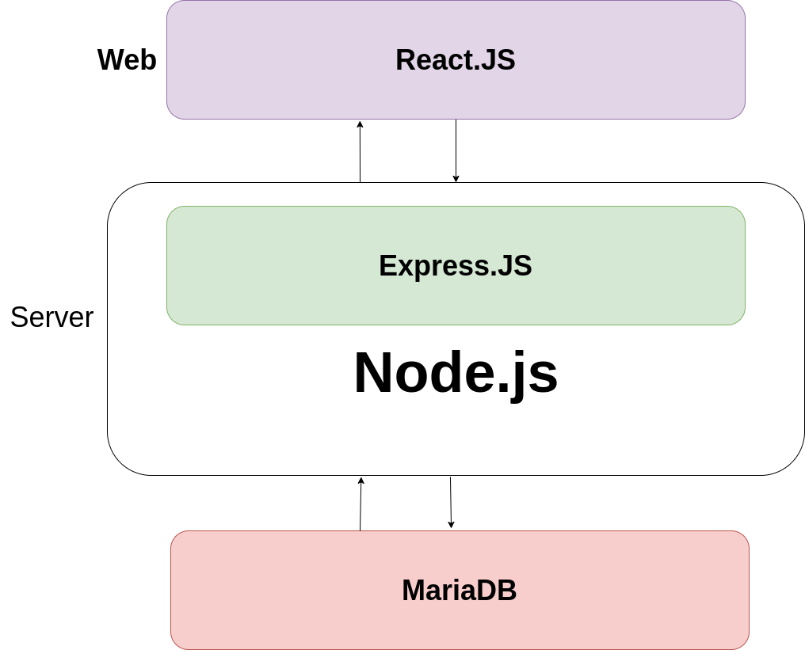

# FullStack-React-Node-Docker-App-Template

## Overview
This project consists of a static React site that communicates with a Node.js API, which in turn queries a MariaDB database to retrieve data. The application is containerised using Docker and can be deployed easily using Docker Compose. This is just an example of how to create a full stack architecture of a static react website. This is not for production, just an example and a foundation block. 

### Technologies Used
- React
- Node.js
- MariaDB
- Docker
- Nginx

### Features
- Frontend built with React.
- Backend API using Node.js.
- MariaDB for data storage.
- Containerised using Docker.
- Deployment with Docker Compose.

### Diagram




### How to use it? 

Clone the repository:
```
git clone https://github.com/RattyMyles/FullStack-React-Node-Docker-App-Template.git
```
Navigate to the project directory:
```
cd FullStack-React-Node-Docker-App-Template
```
Build the application using the build script and ensure it's excutable:
```
chmod +x build.sh
./build.sh
```
This builds the docker images locally to be able to run later.

Run the application using Docker Compose:
```
docker compose up -d
```

Access the application in your browser at http://localhost:8080.


### Further details

#### MariaDB
In this small project, we import a sql file into the MariaDB. This will initiate a database schema, a table, a few inserts and a user. 
This can be modified in this directory "FullStack-React-Node-Docker-App-Template/data".

We import this file via the docker-compose.yml volumes when the container boots up:
```
    volumes:
      - ./data/data.sql:/docker-entrypoint-initdb.d/data.sql
```


#### NodeJS Express Server
This serves as a middle layer between the database and the front end application. 
We pass the database credentials via environment variables. 

#### React Nginx
The Dockerfile for the front-end is a multistage build. This will will build the react assets and then using Nginx to serve these frontend assets. 
You can find the file "/home/myles/Documents/home_projects/FullStack-React-Node-Docker-App-Template/react-frontend" 


### Improvements? 

I welcome any feedback or suggestions. As this is just a template, I haven't focused on security, kubenetes deployment, cloud deployment, DNS or scaling/availability.
My next phase of this project or another project is to incoorperate it with RabbitMQ. Include a queueing service, similar to AWS SQS. Afterwards scaling out the database by having a cluster potentially and maybe have a redis service for caching. Then we can stress test this baby and see how many requests we can get per second without any failures :) 
